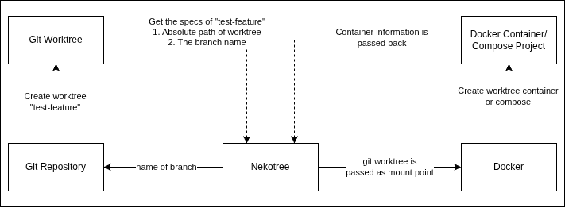

# 🏗️ Architecture

Nekotree operates as a bridge between the Git version control system and the Docker container engine.

## System Overview

The following diagram illustrates how Nekotree manages the lifecycle of a development environment:

### Git Worktree Management
Nekotree utilizes native Git worktrees to allow multiple branches of the same repository to be checked out simultaneously in different directories. This avoids the overhead of `git checkout` and `git stash` when switching tasks.

### Docker Socket Passthrough
When running Nekotree inside a container (the "Manager"), it communicates with the host's Docker engine via `/var/run/docker.sock`. 
- **Internal Paths**: `/workspace/nekotree-repo-branch`
- **Host Paths**: `/home/user/Gitea/nekotree-repo-branch`

The `NEKOTREE_HOST_PATH` environment variable ensures that when the manager container requests a volume mount, it provides the path the **Host** understands, not the internal container path.

## UML Class Diagram

Below is the automatically generated UML diagram representing the internal Go package structure and relationships.

